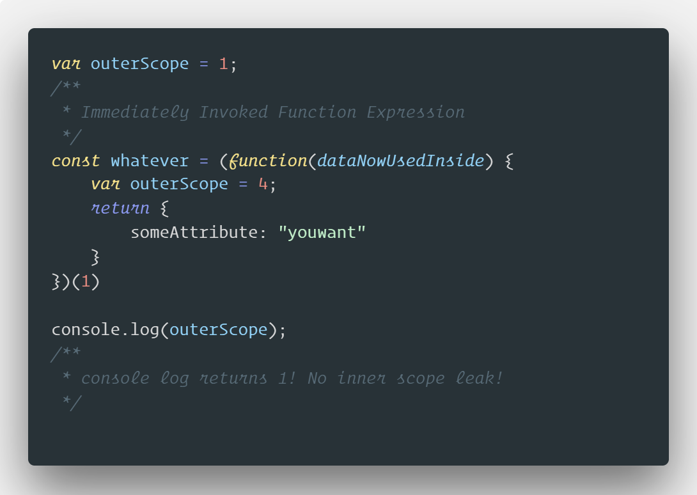

# Chapter 1: why?

Why are we using Webpack and what problems does it solve? At its core, it’s a very simple tool in terms of its standalone capabilities.

## Problems with Script Loading

But why? It is important to understand how we’ve used JavaScript on the web. There are really only 2 ways that you can use JavaScript in the browser. JavaScript is really just a script with top-down execution. The first way to load JavaScript in the browser is via a ```<script>``` tag. The second way is to actually write JavaScript in your HTML.

**But what are the problems with these things?**


They don’t scale, you might have too many scripts, and each browser has bottlenecks. You could end up with unmaintainable scripts; scope, size, readability, fragility, monolithic files.

**Potential solutions?**



Immediately Invoked Function Expressions! Treat each file as an IIFE (Revealing Module Pattern). Using this pattern, you can now concatenate files without any concern of scope collision! This idea lead to the explosion of tools such as; **Make**, **Grunt**, **Gulp**, **Broccoli**, **Brunch**, **StealJS**. All of which are used to concatenate JS files.

But there are still problems… Full rebuilds every time. Dead code (code you are not using). Lots of IIFEs are slow. No way to lazy load.
